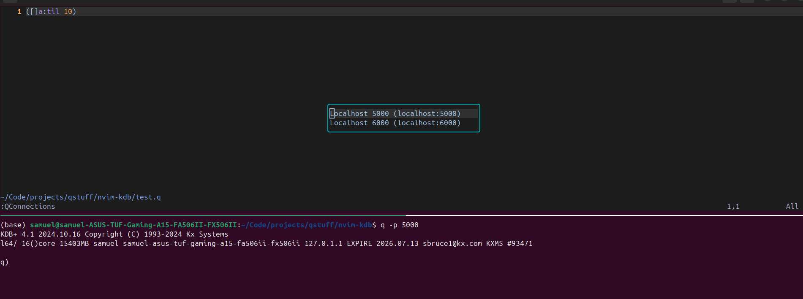
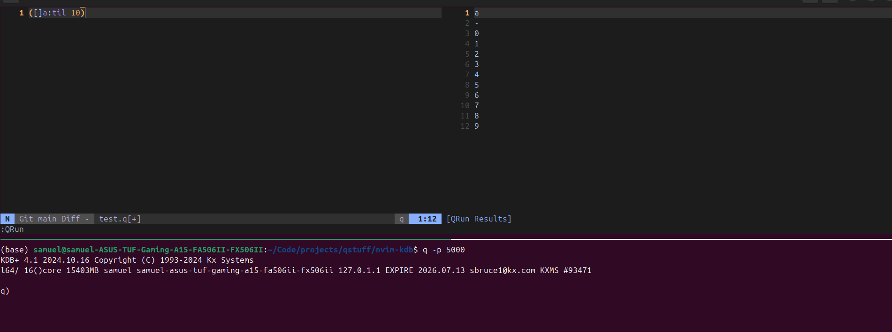

# nvim-kdb

This project allows executing q code inside of neovim via PyKX Sync Connections.

## Requirements

- [PyKX](https://code.kx.com/pykx/3.1/getting-started/installing.html)
- [pynvim](https://github.com/neovim/pynvim)

## Installation

1. Move `q_runner.py` into your remote plugins

    ```bash
    mkdir -p ~/.config/nvim/rplugin/python3
    cp q_runner.py ~/.config/nvim/rplugin/python3/
    ```
2. Open neovim and run `:UpdateRemotePlugins`
3. Restart neovim
4. (Optional) add the following to your `init.lua`
    ```lua
    vim.api.nvim_set_keymap('n', '<Leader>r', ':QRun<CR>', { noremap = true, silent = true })
    vim.api.nvim_set_keymap('v', '<Leader>r', ':QRun<CR>', { noremap = true, silent = true })

    vim.api.nvim_set_keymap('n', '<Leader>p', ':QConnections<CR>', { noremap = true, silent = true })
    vim.api.nvim_set_keymap('v', '<Leader>p', ':QConnections<CR>', { noremap = true, silent = true })
    ```
## Running

1. List preset connections with `<Leader>p` or `:QConnections`, navigate and select connection with j/k and Enter.



2. Execute against connection with `<Leader>r` or `:QRun`, this pops up a new buffer, but if you already have a previous execution window it sticks.



__Tip__: `<C-w><C-K>` moves a vsplit to a split if you prefer it automatically opening to the bottom 